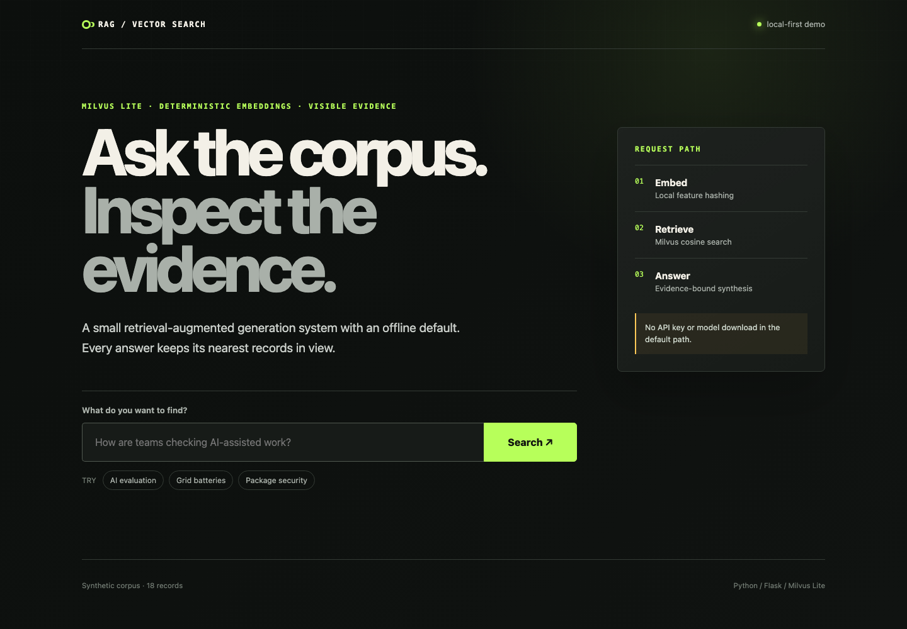

# RAG Vector Search

A small, inspectable RAG system that runs locally, stores vectors in Milvus Lite, and keeps every retrieved record visible beside the answer.

The default demo is deliberately self-contained. It uses 18 synthetic records, deterministic local embeddings, and an extractive answer path. It needs no Docker service, dataset download, model download, API key, or paid provider call.



## What this proves

- One embedding contract indexes documents and questions.
- Milvus stores the full evidence record, not only a label or vector.
- A versioned bootstrap verifies existing data instead of dropping it.
- The web app is import-safe and escapes retrieved text.
- Generation is replaceable. The offline answer path is the default; OpenAI is an explicit optional adapter.
- Dependencies are locked, hashed, and checked against two vulnerability sources before installation.

## Quick start

Requirements: Python 3.11, 3.12, or 3.13 and
[uv](https://docs.astral.sh/uv/).

```bash
git clone https://github.com/Panolof/rag-vector-search.git
cd rag-vector-search

# Fail closed on source, hash, yanked-release, PyPI advisory, or OSV advisory issues.
uv run --no-project --python 3.11 python scripts/verify_lock.py

# Install only the reviewed lock.
uv sync --locked

# Create or verify the local synthetic index.
uv run --frozen rag-vector-search bootstrap

# Run the interface on localhost.
uv run --frozen rag-vector-search serve
```

Open <http://127.0.0.1:5000>.

Search from the terminal instead:

```bash
uv run --frozen rag-vector-search search \
  "What is changing in software dependency security?"
```

Milvus Lite permits one process at a time to own a local database file. Stop the web server before using the terminal command against the same `RAG_DB_URI`.

## Request path

```text
synthetic JSONL
      -> deterministic 384-d embeddings
      -> Milvus Lite / cosine AUTOINDEX
      -> score + shared-term relevance gate
      -> nearest evidence records
      -> extractive answer + visible sources
```

The local database is written to `data/news_demo.db` and ignored by Git. Bootstrap is idempotent. If the collection schema, records, or embedding contract differ, the command leaves existing data untouched and asks for a new `RAG_COLLECTION` name.

Read [how the demo works](docs/innerworkings.md) for the schema and trust boundaries.

## Optional provider generation

Provider mode can incur cost and sends the question plus retrieved synthetic records to the configured provider. The repository never enables it automatically.

```bash
uv sync --locked --extra openai

export RAG_GENERATOR=openai
export OPENAI_MODEL=<model-name>
export OPENAI_API_KEY=<api-key>

uv run --frozen rag-vector-search search "How do local evaluation gates work?"
```

The adapter is lazy-loaded, limits context and output, and instructs the model to treat retrieved records as untrusted data. Provider output remains probabilistic and requires its own evaluation. Provider mode is terminal-only. The web factory rejects it so a cross-origin browser form cannot trigger paid calls against localhost.

## Remote Milvus

The same `MilvusClient` path can target a remote deployment:

```bash
export RAG_DB_URI=https://your-milvus-endpoint.example
export MILVUS_TOKEN=<token>
```

Milvus Lite is the tested demo target. Authentication, transport security, tenancy, backup, and production serving remain the remote operator's responsibility.

## Tests and security checks

```bash
uv run --frozen pytest
uv run --frozen pip-audit --local --progress-spinner off
uv run --no-project --python 3.11 python scripts/verify_lock.py
```

The tests cover configuration, corpus validation, deterministic embeddings, query limits, evidence shaping, provider isolation, HTML escaping, response headers, import safety, Milvus Lite bootstrap, reopened-database search, and mismatch preservation.

See the dated [dependency review](docs/dependency-review.md) and [security policy](SECURITY.md). Vulnerability databases cover known reports, not unknown malicious behaviour, so dependency minimisation and provenance review still matter.

## Configuration

| Variable | Default | Purpose |
|---|---|---|
| `RAG_DB_URI` | `data/news_demo.db` | Local database file or remote Milvus URI |
| `RAG_COLLECTION` | `synthetic_news_v4` | Versioned collection name |
| `RAG_DIMENSION` | `384` | Hashing-embedding dimension |
| `RAG_TOP_K` | `4` | Retrieved evidence count, maximum 20 |
| `RAG_MIN_SCORE` | `0.08` | Minimum cosine score before a record can support an answer |
| `RAG_MIN_SHARED_TERMS` | `2` | Distinct normalised terms the question and record must share |
| `RAG_GENERATOR` | `extractive` | `extractive` or `openai` |
| `MILVUS_TOKEN` | unset | Optional remote Milvus credential |
| `OPENAI_MODEL` | unset | Required only for OpenAI mode |
| `OPENAI_API_KEY` | unset | Required only for OpenAI mode |

## Limits

- The checked-in corpus is synthetic and intentionally small.
- Feature hashing is a reproducible lexical baseline, not a frontier semantic embedding model.
- A result must meet the score threshold and share at least two distinct normalised terms with the question. This filters the tested no-overlap and one-term-bait queries. It is a lexical heuristic, not an entailment check.
- Similarity scores are useful for ranking within this corpus, not as calibrated relevance probabilities.
- The built-in Flask server is for local demonstration, not internet-facing production use.
- The optional provider adapter is structurally tested with a fake client. No paid live request is part of the test suite, and provider mode is unavailable through the web interface.

## Project layout

```text
src/rag_vector_search/   application, retrieval, storage, and generation
templates/               accessible Flask interface
static/                  responsive visual system
tests/                   unit, web, security, and Milvus Lite integration tests
scripts/verify_lock.py   pre-install PyPI and OSV gate
docs/                    architecture and dependency evidence
uv.lock                  exact universal dependency lock with SHA-256 hashes
```

Project-authored code is available under the [MIT licence](LICENSE). Reachable
Git history also contains Milvus Docker Compose release material under the
Apache License 2.0. See [Third-party notices](THIRD_PARTY_NOTICES.md).
